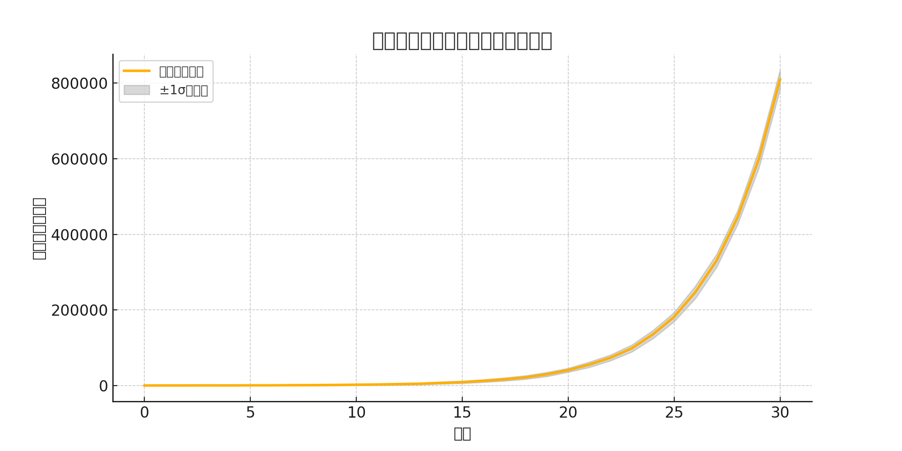

# 推し活における投げ銭金額の数理モデル

## 概要

本稿では、VTuber・配信者文化の拡大とともに浸透している「推し活」に注目し、金銭的支援行為としての投げ銭について数理的にモデル化を行った。推し数が時間とともに増加し、確率的に投げ銭が発生するという仮定のもと、投げ銭総額の期待値と分散を導出し、シミュレーションによって挙動を可視化した。さらに、今後の推し活における持続可能性や破産リスクについての考察を行う。

## はじめに

近年、VTuber・配信者文化の拡大により、いわゆる「推し活」は多くの人々の日常生活の一部となりつつある。推し活とは、特定の配信者・アーティストなどを応援し続ける活動であり、その表現形式はSNSでの反応から、リアルイベントの参加、そして何よりも**投げ銭**という直接的な金銭的支援にまで至る。

推し活は一見するとポジティブな行為だが、**推しが増えることによる負担の増加**や、**習慣化された課金行動**によって家計が逼迫するという現象がしばしば観察されるようになった。しかし、これらの現象は感覚的に語られることが多く、数理的なモデルによってその構造が明らかにされることは稀である。

本研究では、「推しが時間とともに増える」「一定確率で投げ銭をする」「推しを推す限り投げ銭は止まらない」という、現代の推し活文化を象徴する仮定に基づき、将来的な支出額を理論的に予測するモデルを構築する。

## 推し活における投げ銭の数理モデル

### 推しの増加モデル

* 時刻: $t \ge 0$
* 推し数: $P(t) = P_0 e^{\alpha t}$

  * $P_0$: 初期推し数
  * $\alpha > 0$: 推しの増加率

### 投げ銭モデル

* 各推しは単位時間あたり確率 $q$ で投げ銭イベントを発生させる
* 投げ銭金額は正規分布 $X \sim \mathcal{N}(\mu, \sigma^2)$ に従う
* 投げ銭額の合計 $S(t)$ は以下の和で表される：

$$
S(t) = \sum_{i=1}^{P(t)} Y_i
$$

$Y_i$ は以下の確率変数：

$$
Y_i = \begin{cases}
X_i & \text{with probability } q \\
0 & \text{with probability } 1 - q
\end{cases}
$$

## 推し活における投げ銭の数理モデルの提案

### 理論結果

#### 期待値

$$
\mathbb{E}[S(t)] = q \mu P_0 e^{\alpha t}
$$

#### 分散

$$
\mathrm{Var}[S(t)] = \left[q(1 - q)\mu^2 + q\sigma^2\right] P_0 e^{\alpha t}
$$

#### 標準偏差と相対的変動

$$
\frac{\sigma_{S(t)}}{\mathbb{E}[S(t)]} = O(e^{-\alpha t / 2})
$$

→ 時間が経つと相対的なばらつきが指数関数的に収束し、期待値に集中する。

## 提案した数理モデルのシミュレーション結果

* 初期推し数: $P_0 = 1$
* 増加率: $\alpha = 0.3$
* 平均投げ銭額: $\mu = 1000$ 円
* 標準偏差: $\sigma = 300$ 円
* 投げ銭確率: $q = 0.1$
* シミュレーション期間: 30日
* モンテカルロ試行回数: 100

* 青線：日ごとの平均投げ銭額
* 灰色の帯：標準偏差による$\pm 1\sigma$の範囲

## まとめ

### 考察

* 推し数の指数増加により、投げ銭合計額の期待値も爆発的に増加する
* 分散も増えるが、相対的には収束するため、「ほぼ確実に破産する」挙動が現れる
* より現実的なモデルには、財布の上限、投げ銭熱の減衰、課金頻度の飽和などを導入する必要がある

### 今後の展望

* ライフプランを考慮した破産回避戦略のモデル化
* 推し毎のパラメータ分布（熱量や投げ銭しやすさ）の導入
* ロジスティック成長による推し数の飽和を考慮したモデルの導入

### 結論

このモデルを通じて明らかになったのは、推し活に対して無制限に投げ銭を行う場合、指数関数的に財布が消耗し、破産の未来が避けられないということである。ただし、それを定量的に理解することで、持続可能な推し活ライフを設計する道も開ける。推し活は文化であり、経済活動であり、そして人間の情熱の象徴である。その熱量を維持しつつ、持続可能性とのバランスを見出すことが、これからの課題である。
